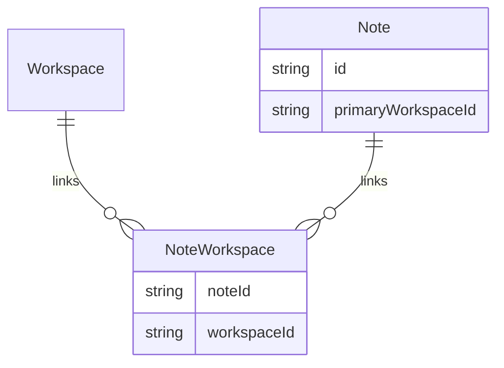

# Data model review (workspace, brand, multi-user)

Snapshot of **current** Prisma models relevant to the product vision and **gaps** to close.

## Current anchors

### `Brand`

- `Brand` holds **`name`** (canonical label for lists/settings), **`brandProfile`** JSON (identity kit for AI and Brand Center), **`position`**, **`archivedAt`**.
- **Team context** for agents (methodology shared across the engagement) is stored as **`teamContextInstructions`** (`Text`, optional)—see [context ladder](../vision/context-ladder.md).

### TaskFoundry `Workspace`

- `Workspace` has **`name`**, **`brandId`** (required, **unique**—one workspace ecosystem per brand).
- Contains: `ProjectSpace`, `NotesFolder`, `Note`, `ChatThread` (optional link), link to Brainstorm `Project`.
- **User / operator context** (individual consultant preferences for this workspace) is **`userContextInstructions`** (`Text`, optional).
- **Implication:** “Switching workspace” in the UI = switching **brand** for practical purposes. The brand kit is on **`Brand.brandProfile`**, not on `Workspace`.

### Brainstorm `Project`

- Separate from the TaskFoundry workspace row but **scoped by `workspaceId`** (one brainstorm/RAG project per brand workspace).
- Holds `BrainstormSession`, `ChatThread`, `ChatDocument` for RAG.
- **Implication:** Cross-linking uses `workspaceId` on threads where wired.

### Notes

- `Note` is scoped with `workspaceId` and optional `folderId`.
- `NoteLink` connects notes in a graph.

### Tasks

- `Task` lives under `BoardList` → `Board` → `ProjectSpace` → `Workspace`.
- **No `assigneeId` or `User` relation** in schema (no `User` model in `schema.prisma` at review time).
- **Implication:** Multi-user accountability, “people” filters, and PM Agent capacity features require **identity and membership** models.

## Authentication and users

- **Finding:** Prisma schema does **not** define `User`, `WorkspaceMember`, or OAuth identities.
- **Recommendation:** Before assigning tasks to people or filtering the calendar by person, add:
  - `User` (or integrate external IdP subject),
  - `WorkspaceMember` (`userId`, `workspaceId`, `role`),
  - Optional `Task.assigneeId` → `User`.

Until then, document PM Agent and calendar “people” filters as **future** or use **free-text** fields only with clear limitations.

## Decision: Brand vs Workspace (updated)

| Model | Role today |
|-------|------------|
| **`Brand`** | Canonical client/company name + brand kit JSON + team context instructions. |
| **`Workspace`** | One ecosystem row per brand: notebooks, boards tree, notes, chat default scope, user context instructions. |

Future option: multiple `Workspace` rows per `Brand` if product requires many delivery threads under one kit—would relax `brandId @unique` and add rules for default workspace.

## ERD: note ↔ project space associations (future)

Today: `Note.workspaceId` is **single**.

Product ask: notes assignable to **multiple** project spaces, possibly independent of folder.

**Sketch (not migrated):**

Alternative: **tags** that reference workspace ids (lighter migration).

## Holding pens

Options:

1. **Folder convention:** e.g. folder titled `Inbox` / `Rapid Router` under each notebook tree.
2. **Flag:** `NotesFolder.isHoldingPen` or `Note.isInbox`.
3. **Tag:** system tag `source:rapid-router`.

Pick one for consistent queries and Mail Clerk routing.

## Provenance (tasks ← notes / brainstorm)

Extend `Task` with optional:

- `sourceKind`: `brainstorm | note | rapid_router | chat`
- `sourceId`: opaque id
- Or `metadata Json` for flexibility without migration churn.

See [task-cross-surface-provenance.md](../product/task-cross-surface-provenance.md).

## References

- [glossary.md](../vision/glossary.md)
- [project-boards.md](../product/project-boards.md)
- [notebooks.md](../product/notebooks.md)
- [workspace-brand-chrome.md](../product/workspace-brand-chrome.md)
