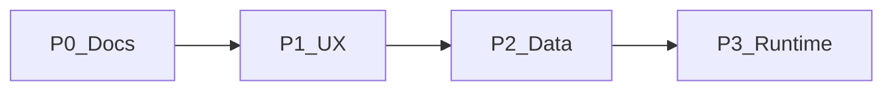

# Roadmap phasing

Aligned with the agent architecture plan: ship **documentation and contracts** first, then **UX**, then **data**, then **runtime**.

## P0 — Documentation (complete)

- [Glossary](../vision/glossary.md), [context ladder](../vision/context-ladder.md), [CONTEXT_BUNDLE](../integrations/CONTEXT_BUNDLE.md).
- Agent one-pagers under [docs/agents/](../agents/).
- Product PRDs under [docs/product/](../product/).
- [Copy alignment P0](../ux/copy-alignment-p0.md), [data model review](../architecture/data-model-review.md).

## P1 — UX

- Sidebar title → active workspace name + truncation + picker (`WorkspaceSidebarColumn`).
- Consistent agent naming in UI (Red Team, Mailroom entry points).
- Brainstorm panel: fold behavior parity with other surfaces (polish).

## P2 — Data model

- Team and user context document storage + resolution into `prepareTurn`-style assembly (**in progress**: `Brand.teamContextInstructions`, `Workspace.userContextInstructions`, API `GET/PUT …/context-instructions`, consulting chat + brainstorm assembly).
- Optional `WorkspaceMember` / `User` if multi-tenant auth lands.
- Note ↔ workspace (project space) many-to-many if product requires divergent associations.
- Task provenance fields for cross-surface exports.

## P3 — Agent runtime (optional)

- Unified API: `{ agentId, contextBundle }` → composed system prompt (**partial**: `POST /api/ai/agent` for `surfaceType: brainstorm` maps `agentId` to brainstorm roles; full bundle for chat/notes TBD).
- Tool use (create note, move task) with permissions.
- Background jobs for notebook link refresh.

## Dependencies graph (simplified)

